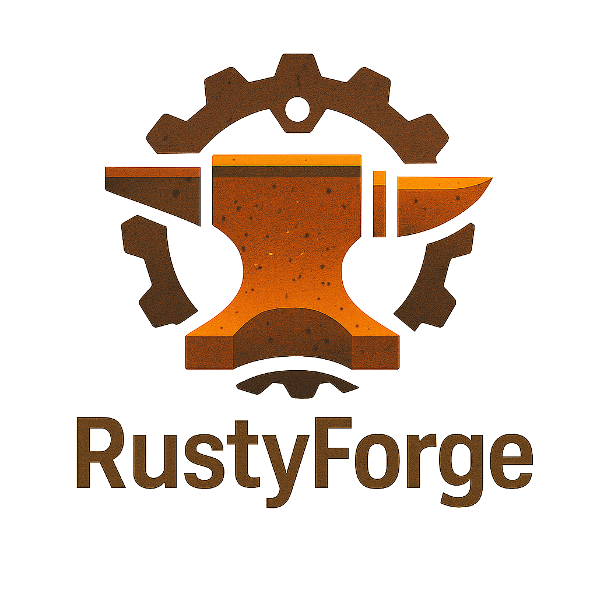
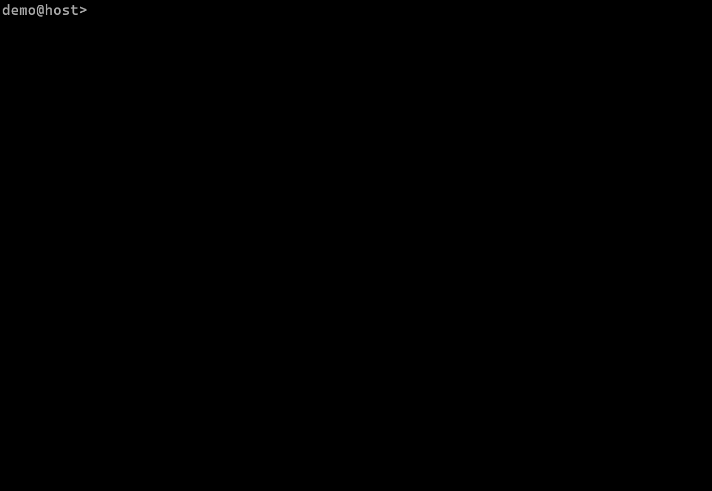

<div style="display: flex; justify-content: center; align-items: flex-start;">
  
</div>


# Rusty Forge

RustyForge is a minimal, fast, and cross-platform build system for C.
It’s designed for simplicity and ease of use, with modern features like toml-based configuration, parallel builds,
and hash-based caching.
Ideal for both beginners and experienced developers looking for a streamlined alternative to Make.


---

## Current Features

- Parsing the `RustyForge.toml` configuration file  
- Hash-based caching, to avoid unnecessary compilation (including `.h` files)
- Compiling individual `.c` files to `.o` files with correct include paths  
- Parallel compilation, for faster builds
- Linking `.o` files into the final executable  
- Support for linking and building static (`.a`) and dynamic (`.so`/`.dll`) libraries
- Cross-platform support (Windows/Linux) with proper handling of paths and executable extensions
- Uses `gcc` as the compiler

---

## Planned Features

- Test targets and automated test execution 
- Cross compilation
- Support for more compilers (`clang` `tcc`)
- Support for non gcc-based toolchains

---

## CLion Plugin (Planned)

- Automatically detect and add new source files to the build configuration  
- Show build errors directly in the IDE  
- Facilitate easy maintenance of `RustyForge.toml`  
- Syntax highlighting and autocomplete for `RustyForge.toml`

---

## Installation

1. Clone rustyforge repository  
2. Install Rust toolchain (Rust 1.70 or newer recommended)  
3. Run `cargo build --release`  
4. Place the binary in your system path or run directly

---

## Quickstart

- **Run** `rustyforge --version` to check whether rustyforge has been installed successfully
- **Run** `rustyforge --help` to see usage
- **Run** `rustyforge init` to create a new rustyforge project
- **Run** `rustyforge discover` to automatically add files and include directories to the RustyForge.toml
- **Run** `rustyforge build` to build the project
- **Run** `rustyforge run` to run your executable

### Example `Commands`

````shell
rustyforge init
rustyforge discover
rustyforge build --verbose
rustyforge clean
````

<div style="padding: 10px; max-width: 700px; margin: 0;">
  
</div>


---

## Example `RustyForge.toml`

```toml
[project]
name = "project-name"
targets = ["bin", "shared", "static"]

[build]
src = ["src/main.c", "src/foo.c"]
include_dirs = ["include"]
output = "lib_or_executable_name"

[dependencies]
libraries = ["bar"]
library_paths = ["libs"]
include_dirs = ["libs/include"]
posix_libraries = ["m", "pthreads"]
```

---
## Build Benchmark 

*Planned: Direct comparison with Make and CMake, building sqlite3.*

### Configuration

- **Target:** `rustyforge.exe rebuild`
- **Runs:** 10 
- *Every run cleans build artifacts and rebuilds [forksta](https://github.com/konni332/forksta)
    as shared library and executable*
- *Measured with [forksta](https://github.com/konni332/forksta)*

### Performance Summary

| Metric          | Mean     | Min      | Max      | Stddev   | CV (%)  |
|-----------------|----------|----------|----------|----------|---------|
| **Real Time**   | 4.059 s  | 4.020 s  | 4.117 s  | 0.029 s  | 0.72 %  |
| **System Time** | 0.109 s  | 0.094 s  | 0.250 s  | 0.051 s  | 46.41 % |
| **User Time**   | 0.047 s  | 0.016 s  | 0.094 s  | 0.024 s  | 52.12 % |
| **Max RSS**     | 8366 KB  | 8268 KB  | 8588 KB  | 91.3 KB  | 1.09 %  |
| **Exit Code**   | 0 (success) |

### Observations

- The build completed **successfully** in all 10 runs.
- **Real-time performance** was highly consistent, with <1% variation.
- **Memory usage (RSS)** stayed around **8.3 MB** across all runs.
- **System/User time** shows variability due to process scheduling and background activity.

---

## Contact / Contributing

Feel free to open issues or pull requests for questions, ideas, or contributions

---

## License

This project is licensed under either of

- MIT license ([LICENSE-MIT](./LICENSE-MIT) or https://opensource.org/license/MIT)
- Apache license, Version 2.0 ([LICENSE-APACHE](./LICENSE-APACHE) or https://www.apache.org/license/LICENSE-2.0)

at your option.
