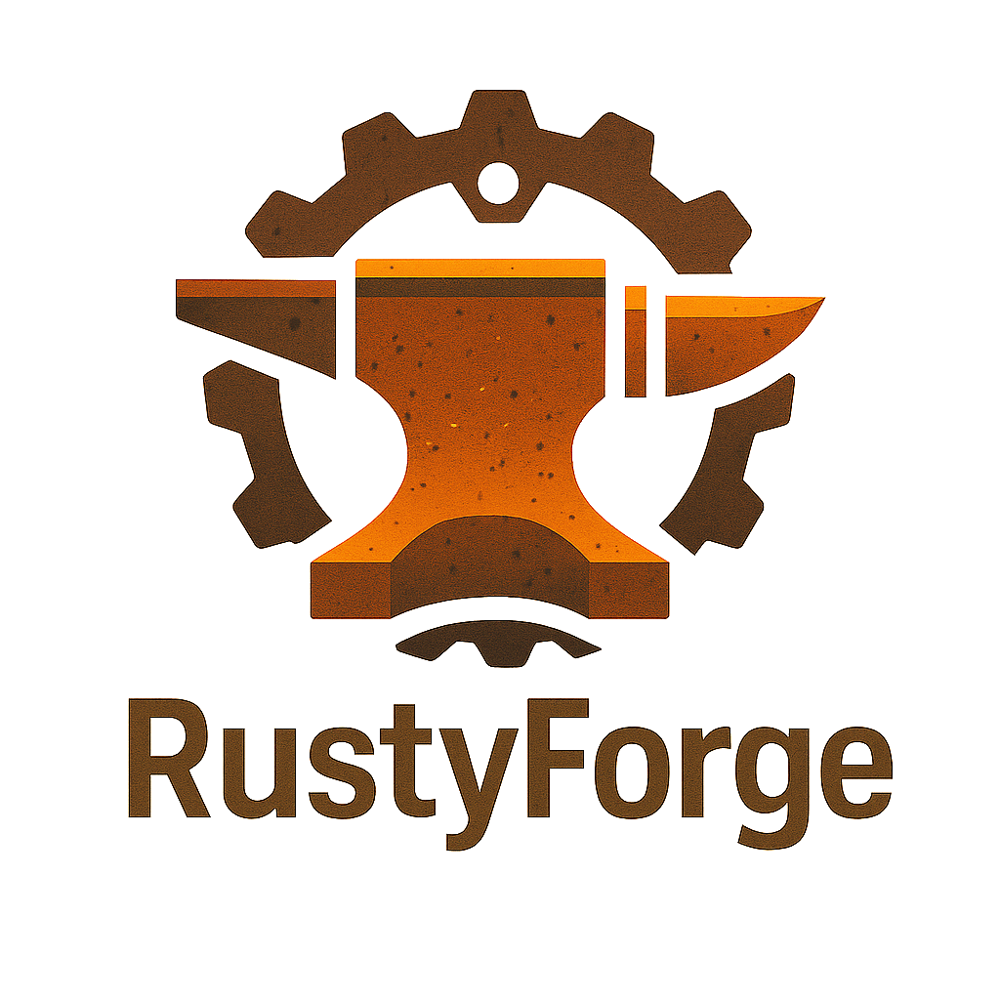

<div style="display: flex; justify-content: center; align-items: flex-start;">
  
</div>


# Rusty Forge


RustyForge is a minimal build manager for C/C++ projects written in Rust. It automates compiling binaries and libraries, supports parallel builds, profiles, features, and manages a build cache.

## Features

- Automatic discovery of source files (*.c, *.cpp).
- Multiple binaries and a static/shared library per project
- Parallel compilation using a configurable thread pool
- Build profiles: dev and release
- Feature-driven compile-time defines
- Fully configurable project manifest via `RustyForge.toml`
- Cli for build, run, clean, info

---

## Installation

From crates.io:

```shell
cargo install rustyforge
```

From GitHub:

```shell
git clone https://github.com/konni332/rustyforge.git
cd rustyforge
cargo install --path .
```

---

## Quick Start

1. Create a new project using `rustyforge new <project-name>` and add a target, e.g. binary or library, to the manifest
2. Add C/C++ source files
3. Build your project:

```shell
rustyforge build --release
```

4. Run a binary:

```shell
rustyforge run --exe your-app
```

## Documentation

For a full reference, see the following documents:

- **CLI Reference:** see [CLI](./CLI.md)
- **Manifest Reference:** see [MANIFEST](./MANIFEST.md)

---

## Examples

### Build a release binary
```shell
rustyforge build --release --exe example
```

### Run a binary with arguments
```shell
rustyforge run --release --exe example -- -p 8080
```

### Clean the build directory
```shell
rustyforge clean
```

### Display project info in JSON
```shell
rustyforge info --json
```

---

## Planned features

Plans for the future include, but are not limited to:

- Dependencies, e.g. a fully fletched dependency system, possibly using a registry and fetching either RustyForge projects or build arifacts.

---

## License

Rustyforge is licensed under either

- [MIT](./LICENSE-MIT)
- [APACHE-2.0](./LICENSE-APACHE)

at your option

---
